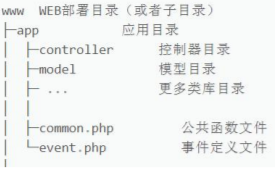
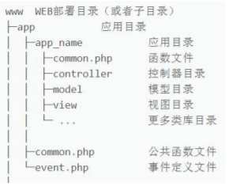
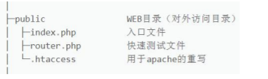
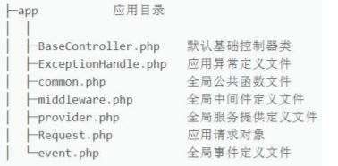

[toc]
# ThinkPHP6

差不多小过了一下thinkphp的框架。

官方的文档和目录中的讲义都比较好。

End.....


# 01 安装

需要安装composer，之后：

```sh
composer config -g repo.packagist composer https://mirrors.aliyun.com/composer/

# 首次安装tp6,切换到要加载的目录：
composer create-project topthink/think tp6
# 如果要更新项目版本，进入项目根目录：
composer update topthink/framework
```

测试：`php think run`，这样自动部署到public里了

# 02 开发规范和目录结构

单应用：



多应用：



多应用章，app_name可以有多个。

在目录结构上，只确保对外可访问的仅 public 目录



app目录：



# 03 开启调式与配置文件

通过命令行安装的 TP6.0，会自动在根目录生成一个.example..env 文件

打开调试的环境变量为 `APP_DEBUG = true`

如何去获取这些配置文件的值： 

 对于.env 文件，比如`[DATABASE]下的 HOSTNAME = 127.0.0.1` 获取方式如下：

```php
use think\facade\Env;
return Env::get('database.hostname'); 
```

 对于 config 文件，比如 database.php 下的 hostname，获取方式如下：

```php
use think\facade\Config; return 
Config::get('database.connections.mysql.hostname');
```


# 04 url 访问模式

>   多应用：`http://serverName/index.php/应用/控制器/操作/参数/值…`
>
>   单应用：`http://serverName/index.php/控制器/操作/参数/值…`

控制器：app 目录下有一个 controller 控制器目录的 Test.php(控制器)


# 05 控制器定义


如果想改变系统默认的控制器文件目录，可以在 config 下route.php 配置：`'controller_layer' => 'controller123',`

类名和文件名大小写保持一致，并采用驼峰式（首字母大写）；

```php
namespace app\controller; 
class Test {...}
```

输出可以直接return，或者数组的话json：

```php
$data = array('a'=>1, 'b'=>2, 'c'=>3);
return json($data);
```

```php
class Demo1 extends BaseController
{

    public function  Demo_Fun()
    {
        $array=['a','b','c'];
        halt('a',$array);
//        return "qwer";
    }
    public function index()
    {
//        返回目录
//        return $this->app->getBasePath();
//        返回当前方法名
        return $this->request->action();
    }
}
```

# 06 基础.空.多级控制器

多级控制器：

们在 controller 目录下建立 group 目录，并创建 Blog.php 控制器；

访问：`http://localhost:8000/group.blog`


# 07 连接数据库与模型初探

根目录的 config 下的 database.php 可以设置数据库连接信息；


# 08 数据库的数据查询

一．单数据查询 

1. Db::table()中 table 必须指定完整数据表（包括前缀）；
2. 如果希望只查询一条数据，可以使用 find()方法，需指定where 条件；
`Db::table('tp_user')->where('id', 27)->find()` 
3. `Db::getLastSql()`方法，可以得到最近一条 SQL 查询的原生语句；``SELECT * FROM `tp_user` LIMIT 1 ``
4. 没有查询到任何值，则返回 null； 
5. 使用 `findOrFail()`方法同样可以查询一条数据，在没有数据时抛出一个异常；``Db::table('tp_user')->where('id', 1)->findOrFail() ``
6. 使用 findOrEmpty()方法也可以查询一条数据，但在没有数据时返回一个空数组；
7. Db::table('tp_user')->where('id', 1)->findOrEmpty();

# 09 数据库链式查询

# 10 数据库数据新增

# 11 数据库删除修改

# 12 数据库查询表达式

